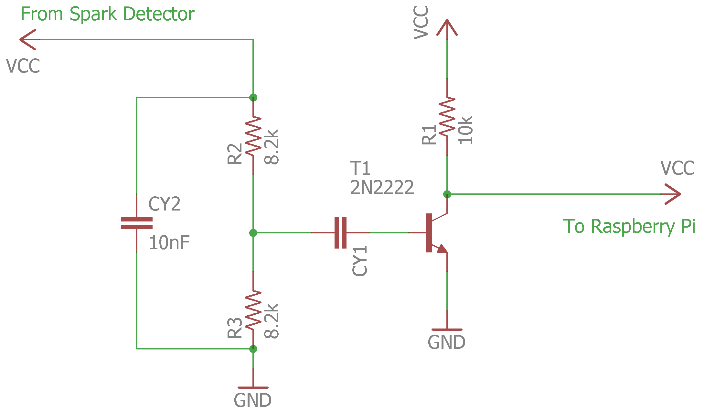
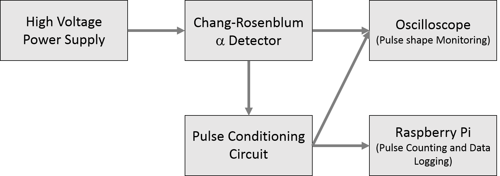

# Alpha Spark

Raspberry Pi code for measuring the interaction rate of alpha particles in a
Chang-Rosenblum type alpha particle detector.

## Schematic

## Block Diagram

## Contributors

  * Shawn Sinclare
  * Andrew Jones
  * Christina Kirby
  * Kurt Jacobson

## Advisors

  * Dr. Eduardo B. Farfan
  * Dr. Sandip Das
